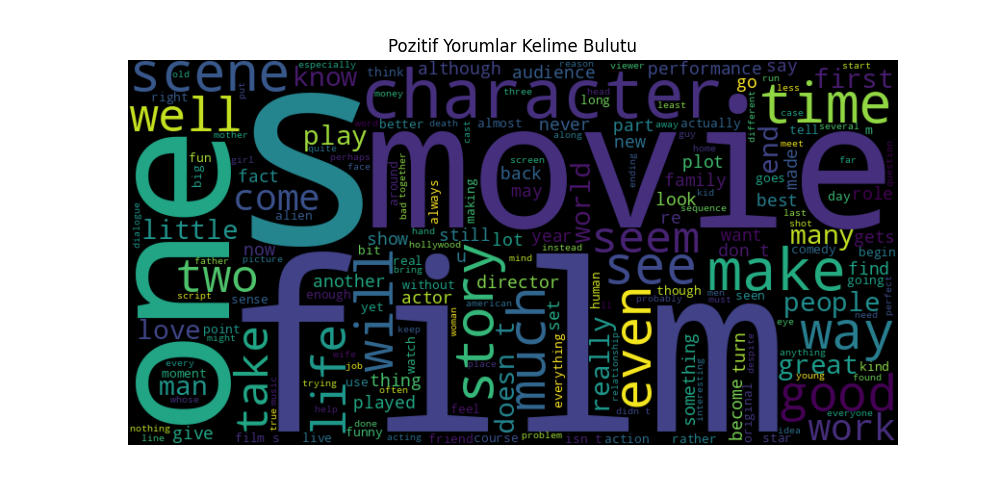
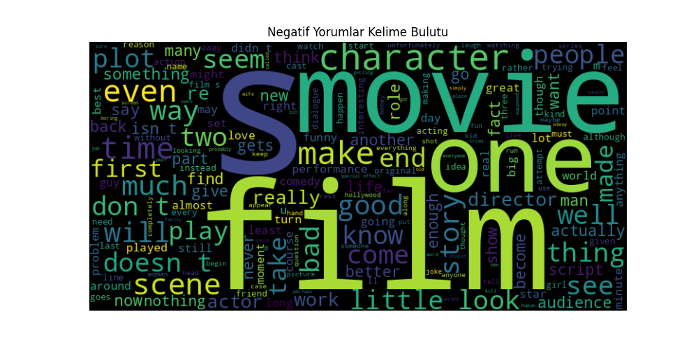
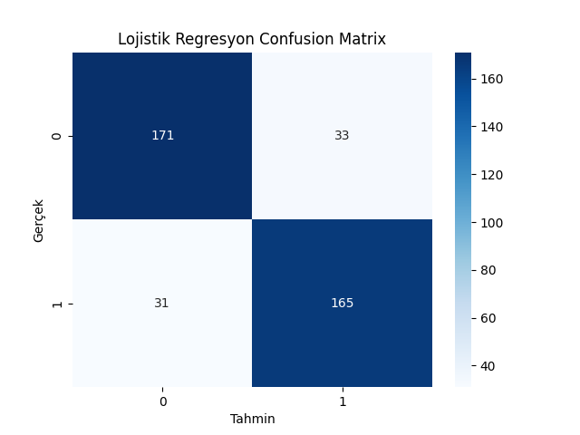
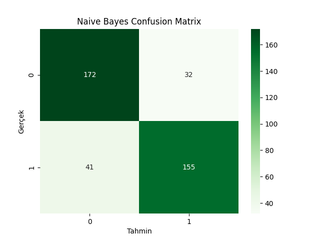
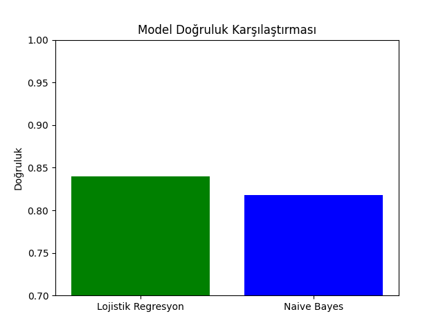

# 🎬 Movie Review Sentiment Analysis (Film Yorumu Duygu Analizi)

## 📌 Proje Hakkında
Bu proje, **Doğal Dil İşleme (NLP)** teknikleri kullanılarak film yorumlarının duygu durumunu (pozitif veya negatif) analiz eden bir makine öğrenmesi modelidir. 

Projede **NLTK (Natural Language Toolkit)** kütüphanesindeki `movie_reviews` veri seti kullanılmış, metin verileri işlenmiş ve **Lojistik Regresyon** ile **Naive Bayes** algoritmaları karşılaştırılarak en iyi sonuç hedeflenmiştir.

---

## 🚀 Kullanılan Teknolojiler ve Kütüphaneler
Proje geliştirilirken aşağıdaki araçlar ve kütüphaneler kullanılmıştır:

* **Python:** Ana programlama dili.
* **NLTK:** Veri seti ve dil işleme araçları.
* **Scikit-learn:** Makine öğrenmesi modelleri (Logistic Regression, MultinomialNB) ve vektörleştirme (TF-IDF).
* **Pandas & NumPy:** Veri manipülasyonu ve sayısal işlemler.
* **Matplotlib & Seaborn:** Veri görselleştirme ve Confusion Matrix çizimi.
* **WordCloud:** Metin verisindeki sık geçen kelimelerin görselleştirilmesi.

---

## 📊 Veri Seti ve Ön İşleme
Projede kullanılan veri seti NLTK kütüphanesinden temin edilmiştir:
* **Toplam Yorum Sayısı:** 2000 (1000 Pozitif, 1000 Negatif)
* **Veri Dağılımı:** Dengeli (Balanced Dataset)

**Uygulanan Ön İşleme Adımları:**
1.  Veri setinin yüklenmesi ve etiketlenmesi (Pos: 1, Neg: 0).
2.  Verilerin karıştırılması (Shuffling) ve DataFrame'e dönüştürülmesi.
3.  **TF-IDF (Term Frequency-Inverse Document Frequency)** Yöntemi ile metinlerin sayısal vektörlere dönüştürülmesi.
    * *Stop words* (etkisiz kelimeler) temizlendi.
    * Düşük ve çok yüksek frekanslı kelimeler filtrelemesi yapıldı.

---

## 📈 Görselleştirme (EDA)
Veri setini anlamak adına Pozitif ve Negatif yorumlar için Kelime Bulutları (WordClouds) oluşturulmuştur.

| Pozitif Yorumlar | Negatif Yorumlar |
| :---: | :---: |
|  |  |

---

## 🧠 Model Eğitimi ve Karşılaştırma
Bu projede iki farklı sınıflandırma algoritması eğitilmiş ve performansları karşılaştırılmıştır:

### 1. Lojistik Regresyon (Logistic Regression)
Genellikle ikili sınıflandırma problemlerinde temel ve güçlü bir baseline modeldir.
* Doğruluk Oranı (Accuracy): **%86**  

  

### 2. Naive Bayes (MultinomialNB)
Metin sınıflandırma problemlerinde (özellikle NLP) sıklıkla tercih edilen olasılık temelli bir algoritmadır.
* Doğruluk Oranı (Accuracy): **%85**  

  

### Confusion Matrix (Karmaşıklık Matrisi)
Modellerin başarımı görsel olarak analiz edilmiştir.
 

  

---

